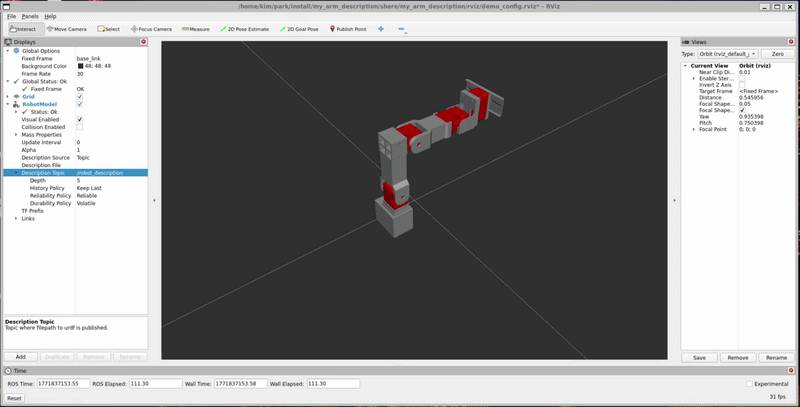

try control 4dof_robot_arm in rviz2.

I will update gripper and teleoperation using openrb-150 and BT 210 soon.
## Setup & Run

```bash
# go to workspace
cd ~/bmir

# source
source /opt/ros/jazzy/setup.bash
source install/setup.bash

# launch (rviz + ik + controller)
ros2 launch my_arm_description ik_demo.launch.py
```

## Send Target Pose

```bash
ros2 topic pub --once /tip_target geometry_msgs/msg/PoseStamped "{
  header: {frame_id: 'base_link'},
  pose: {
    position: {x: 0.20, y: 0.00, z: 0.15},
    orientation: {x: 0.0, y: 0.0, z: 0.0, w: 1.0}
  }
}"
```

* topic: `/tip_target`
* frame: `base_link`
* unit: meter
* controller starts ~5s after first target
