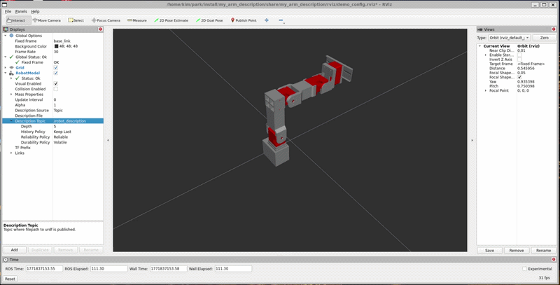

# 4-DOF Fin Ray Robot Arm

> **Status**: 3D-printed parts are complete. PC ↔ ESP32 communication is not yet implemented — the full hardware integration is still in progress.

A 4-degree-of-freedom robotic arm with compliant fin-ray-style joints, controlled via ROS 2 Jazzy.
All mechanical parts were **designed entirely in Fusion 360** from scratch and 3D-printed.

Inverse kinematics are solved using **Damped Least Squares (DLS)** and visualized in RViz2.



## Hardware

- **Actuators**: Dynamixel XL330 ×4
- **Controller**: OpenRB-150
- **Structure**: Custom compliant joints, designed in Fusion 360 and 3D-printed

## System Architecture

| Node | Subscribes | Publishes | Description |
|---|---|---|---|
| `my_arm_ik_node` | `/tip_target` | `/desired_joint_states` | DLS IK solver |
| `my_arm_seq_controller_node` | `/desired_joint_states` | `/joint_states` | Sequential joint controller |
| `robot_state_publisher` | `/joint_states` | TF | URDF → transform tree |

## Setup & Run

```bash
cd ~/bmir
source /opt/ros/jazzy/setup.bash
colcon build --packages-select my_arm_description
source install/setup.bash

# Launch RViz + IK solver + controller
ros2 launch my_arm_description ik_demo.launch.py
```

## Send Target Pose

Send a tip position via `/tip_target` (frame: `base_link`, units: meters):

```bash
ros2 topic pub --once /tip_target geometry_msgs/msg/PoseStamped "{
  header: {frame_id: 'base_link'},
  pose: {
    position: {x: 0.20, y: 0.00, z: 0.15},
    orientation: {x: 0.0, y: 0.0, z: 0.0, w: 1.0}
  }
}"
```

> The controller begins moving ~5 seconds after the first target is received.

## View URDF Only

```bash
ros2 launch my_arm_description view_rviz.launch.py
```

## Planned Features

- Gripper control via OpenRB-150
- Bluetooth teleoperation via BT 210

## License

MIT
